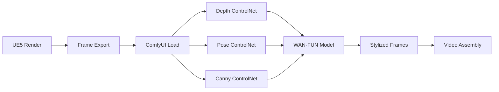
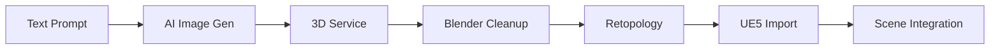
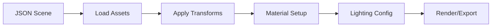

# 🎬 LevlStudio Project - Complete Guide

## **Overview**
LevlStudio is a comprehensive AI-powered 3D content creation pipeline that integrates Unreal Engine 5, ComfyUI, and Blender for automated stylized video production and asset management.

---

## 🏗️ **Project Architecture**

```
LevlStudio Project
├── 🎮 Unreal Engine 5 Integration
│   ├── Scene rendering and export
│   ├── Real-time pipeline monitoring
│   └── Asset import/export automation
├── 🎨 ComfyUI Workflow Engine
│   ├── Triple-ControlNet stylization
│   ├── AI-powered frame processing
│   └── Batch video generation
├── 🎭 Blender MCP Server
│   ├── JSON-driven scene building
│   ├── Asset management system
│   └── Automated rendering pipeline
└── 🤖 AI Integration Layer
    ├── Text-to-3D generation
    ├── Asset cleanup automation
    └── Style transfer workflows
```

---

## 🚀 **Quick Start Guide**

### **1. Prerequisites**
- **macOS** (primary development platform)
- **Unreal Engine 5** (any recent version)
- **Blender 4.4+** installed at `/Applications/Blender.app`
- **ComfyUI** installed at `/Users/workofficial/ComfyUI/ComfyUI`
- **Python 3.8+** with virtual environment support
- **Git** with SSH key configured for GitHub

### **2. Installation**
```bash
# Clone the repository
git clone git@github.com:borngifted/LevlStudio_Project.git
cd LevlStudio_Project

# Set up Python environment
python3 -m venv .venv
source .venv/bin/activate
pip install -r requirements.txt

# Install ComfyUI extensions
cd /Users/workofficial/ComfyUI/ComfyUI/custom_nodes
git clone https://github.com/Fannovel16/comfyui_controlnet_aux.git
git clone https://github.com/Kosinkadink/ComfyUI-VideoHelperSuite.git

# Start auto-git watcher (optional)
python3 auto_git_watcher.py
```

### **3. First Run Test**
```bash
# Test Blender integration
python3 quick_start.py

# Test AI-to-3D pipeline
python3 setup_ai_to_3d_workflow.py

# Test ComfyUI workflow
# Load: workflow_results/complete_ue5_to_comfy_workflow.json
```

---

## 🔧 **Core Components**

### **A. UE5 → ComfyUI Pipeline**

**Purpose**: Transform UE5 renders into stylized videos using AI

**Key Files**:
- `workflow_results/complete_ue5_to_comfy_workflow.json` - Production workflow
- `ue_to_comfy_oneclick.py` - One-click automation
- `levl_ue_to_comfy_oneclick_server.py` - Server mode

**Workflow Process**:
1. **UE5 Export**: Render sequence with fixed settings (no auto-exposure)
2. **Triple ControlNet**: Depth + Pose + Canny guidance
3. **WAN-FUN Stylization**: Consistent frame-to-frame processing
4. **Output**: Stylized video sequence

**Settings**:
- **Depth Control**: 0.7 strength (structure lock)
- **Pose Control**: 0.6 strength (character consistency)
- **Canny Control**: 0.45 strength (edge preservation)
- **Fixed Seed**: 123456789 (temporal consistency)
- **Sampling**: 22 steps, CFG 5.5, denoise 0.45

### **B. Blender MCP Integration**

**Purpose**: JSON-driven 3D scene assembly and asset management

**Key Files**:
- `levlstudio_scene_builder_addon.py` - Blender addon
- `json/assets.json` - Asset definitions with transforms
- `json/scenes.json` - Scene compositions
- `blender_mcp_server.py` - MCP server for external control

**Asset Management**:
- **33 Tracked Assets**: Characters, props, environments, FX
- **7 Scene Configurations**: Pre-built scene compositions
- **Transform Defaults**: Auto-positioning and scaling
- **Material Presets**: Snow, ice, brass, wood materials

**Scene Building Process**:
1. **Load JSON**: Asset and scene definitions
2. **Build Scene**: Automated asset placement
3. **Apply Materials**: Preset material assignment
4. **Lighting Setup**: Time-of-day configurations
5. **Export**: GLB/FBX output for UE5

### **C. AI-to-3D Pipeline**

**Purpose**: Generate 3D assets from text descriptions

**Key Files**:
- `ai_to_3d_pipeline.py` - Main pipeline controller
- `quick_start_ai_to_3d.py` - Simple interface
- `ai_workflows/` - Example workflow configurations
- `setup_ai_to_3d_workflow.py` - Setup automation

**Supported Services**:
- **OpenAI GPT-4**: Concept generation
- **Tripo3D**: Text/image to 3D conversion
- **Meshy**: Alternative 3D generation
- **Hunyuan 3D**: Advanced 3D modeling

**Pipeline Steps**:
1. **Concept Generation**: AI-generated reference images
2. **3D Conversion**: Online service processing
3. **Mesh Cleanup**: Blender automation
4. **Retopology**: Optimization for real-time use
5. **UE5 Import**: Automated asset integration

---

## 📁 **Project Structure**

```
LevlStudio_Project/
├── 📋 Core Configuration
│   ├── .gitignore               # Git ignore rules
│   ├── requirements.txt         # Python dependencies
│   ├── README.md               # Basic project info
│   └── rules.md                # Project guidelines
├── 🎮 Unreal Engine Integration
│   ├── LevlStudio.uproject     # UE5 project file
│   ├── Source/                 # C++ source code
│   ├── Saved/                  # UE5 saved data
│   └── UE_Content_Python/      # Python bridge scripts
├── 🎨 ComfyUI Workflows
│   ├── workflow_results/       # ComfyUI workflow JSONs
│   ├── comfy_workflows/        # Additional workflows
│   └── comfy_bridge_client.py  # ComfyUI integration
├── 🎭 Blender Assets & Scenes
│   ├── assets/                 # Organized 3D assets
│   │   ├── characters/         # Character models & rigs
│   │   ├── props/             # Props and objects
│   │   ├── environments/      # Environment scenes
│   │   ├── fx/                # Effects and particles
│   │   ├── materials/         # Material presets
│   │   └── cameras/           # Camera rigs
│   ├── json/                  # Asset & scene definitions
│   ├── scenes/                # Blender scene files
│   └── levlstudio_scene_builder_addon.py # Main addon
├── 🤖 AI Integration
│   ├── ai_to_3d_pipeline.py   # Main AI pipeline
│   ├── ai_workflows/          # AI workflow configs
│   ├── quick_start_ai_to_3d.py # Simple AI interface
│   └── ai_generated_assets/   # AI output storage
├── 🔧 Automation Scripts
│   ├── quick_start.py         # Project launcher
│   ├── batch_process.py       # Batch operations
│   ├── auto_git_watcher.py    # Auto-commit system
│   └── organize_characters.py # Asset organization
├── 🌐 MCP Servers
│   ├── levl_mcp_server.py     # Main MCP server
│   ├── blender_mcp_client.py  # Blender MCP client
│   ├── start_mcp_server.py    # Server launcher
│   └── test_mcp_server.py     # MCP testing
└── 📤 Output Directories
    ├── exports/               # Final exports
    ├── renders/               # Rendered outputs
    ├── outputs/               # Processing outputs
    └── workflow_results/      # Workflow artifacts
```

---

## ⚙️ **Auto-Push System**

### **Automatic Git Commits**

The project includes an automated git system that commits and pushes changes:

**1. Post-Commit Hook** (`.git/hooks/post-commit`):
- Automatically pushes to GitHub after every commit
- No manual `git push` required

**2. File Watcher** (`auto_git_watcher.py`):
- Monitors project for file changes every 30 seconds
- Auto-commits with timestamped messages
- Runs in background continuously

**To Start Auto-Watcher**:
```bash
cd /Volumes/Jul_23_2025/LevlStudio_Project
python3 auto_git_watcher.py
```

**Manual Commit** (still auto-pushes):
```bash
git add .
git commit -m "Your commit message"
# Automatically pushes to GitHub via hook
```

---

## 🔄 **Workflow Integrations**

### **1. UE5 → ComfyUI → Stylized Video**



### **2. AI → 3D → UE5 Asset Pipeline**



### **3. JSON → Blender → Render Pipeline**



---

## 🛠️ **Configuration**

### **Environment Variables**
```bash
# AI Services (optional)
export OPENAI_API_KEY='your-openai-key'
export GOOGLE_API_KEY='your-google-key'

# Paths (auto-detected)
export BLENDER_PATH='/Applications/Blender.app/Contents/MacOS/Blender'
export COMFYUI_PATH='/Users/workofficial/ComfyUI/ComfyUI'
```

### **Key Configuration Files**
- `json/assets.json` - Asset definitions and transforms
- `json/scenes.json` - Scene compositions and settings
- `.vscode/tasks.json` - VS Code integration
- `commands.json` - Available commands
- `workflow_results/*.json` - ComfyUI workflows

---

## 📚 **Detailed Guides**

### **UE5 Setup**
1. **Install UE5**: Any recent version
2. **Open Project**: Load `LevlStudio.uproject`
3. **Configure Render Settings**:
   - Fixed frame rate (24/30 fps)
   - Disable auto-exposure
   - Turn off motion blur
   - Use high bitrate export

### **ComfyUI Setup**
1. **Install ComfyUI**: Follow official installation
2. **Install Extensions**:
   ```bash
   cd ComfyUI/custom_nodes
   git clone https://github.com/Fannovel16/comfyui_controlnet_aux.git
   git clone https://github.com/Kosinkadink/ComfyUI-VideoHelperSuite.git
   ```
3. **Download Models**:
   - WAN-FUN checkpoint → `models/checkpoints/`
   - ControlNet models → `models/controlnet/`
   - VAE models → `models/vae/`

### **Blender Setup**
1. **Install Addon**: Load `levlstudio_scene_builder_addon.py`
2. **Enable Addon**: In Blender Preferences
3. **Configure Paths**: Point to asset directories
4. **Load JSON**: Import asset and scene definitions

---

## 🐛 **Troubleshooting**

### **Common Issues**

**ComfyUI Nodes Missing**:
```bash
# Install missing extensions
cd ComfyUI/custom_nodes
git clone https://github.com/Fannovel16/comfyui_controlnet_aux.git
# Restart ComfyUI
```

**Blender Addon Errors**:
```bash
# Check Blender Python path
/Applications/Blender.app/Contents/Resources/4.4/python/bin/python3.10 -m pip install debugpy
```

**Git Push Failures**:
```bash
# Check SSH key
ssh -T git@github.com
# Re-authenticate if needed
```

**File Path Issues**:
- Update paths in JSON files
- Ensure relative paths use `//` prefix
- Check file permissions

### **Performance Optimization**

**ComfyUI**:
- Use 1080p for testing, upscale later
- Enable tiling for VRAM limits
- Lower batch size if needed

**Blender**:
- Use collections for organization
- Apply transforms before export
- Optimize mesh complexity

**UE5**:
- Use reasonable render settings
- Avoid heavy post-processing
- Export at consistent quality

---

## 📈 **Project Roadmap**

### **Current Features** ✅
- UE5 → ComfyUI stylization pipeline
- Blender MCP scene building
- AI-to-3D asset generation
- Automated git workflow
- Comprehensive documentation

### **Planned Features** 🚧
- Real-time preview integration
- Advanced material workflows
- Cloud rendering support
- Multi-user collaboration
- Plugin marketplace

### **Future Enhancements** 🔮
- VR/AR preview modes
- Advanced AI integrations
- Custom training pipelines
- Enterprise deployment
- Mobile app support

---

## 🤝 **Contributing**

### **Development Workflow**
1. **Clone Repository**: `git clone git@github.com:borngifted/LevlStudio_Project.git`
2. **Create Branch**: `git checkout -b feature/your-feature`
3. **Make Changes**: Edit files as needed
4. **Auto-Commit**: File watcher handles commits automatically
5. **Manual Commit**: `git commit -m "Your message"` (auto-pushes)

### **Code Standards**
- **Python**: Follow PEP 8 guidelines
- **Blender**: Use addon conventions
- **ComfyUI**: Follow node naming standards
- **Documentation**: Update guides with changes

### **Testing**
- Test each pipeline independently
- Verify cross-platform compatibility
- Check performance on different hardware
- Validate output quality

---

## 📞 **Support**

### **Documentation**
- **This Guide**: Comprehensive overview
- **README.md**: Quick start information
- **Workflow Guides**: Specific pipeline instructions
- **API Documentation**: Technical references

### **Community**
- **GitHub Issues**: Bug reports and feature requests
- **Discussions**: Community help and sharing
- **Wiki**: Collaborative documentation
- **Examples**: Sample workflows and assets

### **Contact**
- **Project Repository**: `git@github.com:borngifted/LevlStudio_Project.git`
- **Issues**: Submit via GitHub Issues
- **Contributions**: Pull requests welcome

---

*Last updated: 2025-08-16*
*LevlStudio Project v2.0 - AI-Powered 3D Content Creation Pipeline*