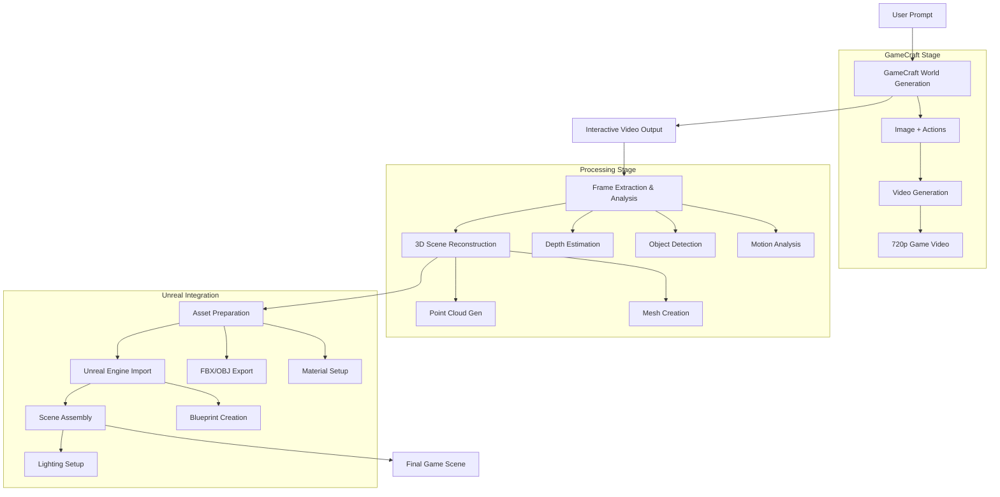

# Hunyuan-GameCraft → LevlStudio → Unreal Engine Pipeline

## Overview

Integration of Hunyuan-GameCraft-1.0 for AI-powered world building that generates interactive game environments and imports them into Unreal Engine as scene bases.

## Pipeline Architecture



## Key Capabilities

### GameCraft Features
- **Interactive Video Generation**: Creates game-like environments with WASD controls
- **High Resolution**: 704x1216 output at 25FPS
- **Action Control**: Keyboard/mouse input simulation
- **Long Sequences**: Autoregressive extension for extended gameplay
- **Fast Mode**: Distilled model for 8-step inference

### Integration Benefits
- **World Building**: Generate entire game environments from text
- **Interactive Exploration**: Use GameCraft for environment design
- **Asset Extraction**: Convert video frames to 3D assets
- **Unreal Import**: Seamless integration with existing pipeline

## Technical Requirements

### Hardware
- **GPU**: 24GB VRAM minimum (80GB recommended)
- **RAM**: 32GB+ for processing
- **Storage**: 100GB+ for models and outputs

### Software Stack
- **GameCraft**: Hunyuan-GameCraft-1.0 model
- **Processing**: OpenCV, MediaPipe, MiDaS depth estimation
- **3D Reconstruction**: Blender Python API, Open3D
- **Export**: FBX SDK, Unreal DataSmith

## Workflow Implementation

### Phase 1: GameCraft Video Generation
```python
def generate_game_world(prompt, actions, image_path=None):
    """
    Generate interactive game world video using GameCraft
    """
    config = {
        'prompt': prompt,
        'actions': actions,  # ['w', 's', 'a', 'd']
        'action_speeds': [0.2, 0.2, 0.2, 0.2],
        'video_size': (704, 1216),
        'fps': 25,
        'frames': 33 * len(actions)  # 33 frames per action
    }
    
    # Run GameCraft inference
    video_path = run_gamecraft_inference(config)
    return video_path
```

### Phase 2: Video Analysis & Processing
```python
def analyze_game_video(video_path):
    """
    Extract spatial and temporal information from GameCraft video
    """
    frames = extract_frames(video_path)
    
    analysis = {
        'depth_maps': [],
        'object_masks': [],
        'camera_motion': [],
        'environment_layout': {}
    }
    
    for frame in frames:
        # Depth estimation
        depth = estimate_depth_midas(frame)
        analysis['depth_maps'].append(depth)
        
        # Object detection
        objects = detect_objects_yolo(frame)
        analysis['object_masks'].append(objects)
        
        # Camera motion analysis
        motion = analyze_camera_motion(frame, prev_frame)
        analysis['camera_motion'].append(motion)
    
    return analysis
```

### Phase 3: 3D Scene Reconstruction
```python
def reconstruct_3d_scene(video_analysis):
    """
    Convert video analysis to 3D scene representation
    """
    scene_data = {
        'meshes': [],
        'materials': [],
        'lighting': {},
        'camera_path': []
    }
    
    # Generate point clouds from depth maps
    point_clouds = []
    for i, (frame, depth) in enumerate(zip(frames, depths)):
        pc = depth_to_pointcloud(depth, camera_intrinsics)
        point_clouds.append(pc)
    
    # Mesh reconstruction
    mesh = reconstruct_mesh_from_pointclouds(point_clouds)
    scene_data['meshes'].append(mesh)
    
    # Material extraction
    materials = extract_materials_from_frames(frames)
    scene_data['materials'] = materials
    
    return scene_data
```

### Phase 4: Unreal Engine Export
```python
def export_to_unreal(scene_data, output_path):
    """
    Export scene data to Unreal Engine compatible format
    """
    # Create FBX exports
    for mesh in scene_data['meshes']:
        fbx_path = export_mesh_to_fbx(mesh, output_path)
        
    # Create material blueprints
    for material in scene_data['materials']:
        bp_path = create_material_blueprint(material, output_path)
        
    # Create level blueprint
    level_bp = create_level_blueprint(scene_data, output_path)
    
    # Generate DataSmith file for complete scene
    datasmith_path = create_datasmith_scene(scene_data, output_path)
    
    return {
        'meshes': fbx_paths,
        'materials': bp_paths,
        'level': level_bp,
        'datasmith': datasmith_path
    }
```

## Integration Points

### With ComfyUI
- Custom GameCraft nodes for ComfyUI workflow
- Batch processing capabilities
- Queue management integration

### With Blender
- Scene reconstruction using Blender Python API
- Material node setup automation
- Animation path creation from camera motion

### With Unreal MCP
- Automatic scene import via MCP commands
- Blueprint creation through natural language
- Level assembly with AI assistance

## File Structure

```
LevlStudio_Project/
├── Hunyuan-GameCraft-1.0/           # GameCraft model
├── gamecraft_integration/           # Integration scripts
│   ├── __init__.py
│   ├── gamecraft_runner.py         # GameCraft inference
│   ├── video_processor.py          # Video analysis
│   ├── scene_reconstructor.py      # 3D reconstruction
│   ├── unreal_exporter.py          # Unreal export
│   └── pipeline_manager.py         # Complete workflow
├── gamecraft_outputs/               # Generated content
│   ├── videos/                     # GameCraft videos
│   ├── frames/                     # Extracted frames
│   ├── depth_maps/                 # Depth estimations
│   ├── meshes/                     # 3D reconstructions
│   └── unreal_assets/              # Unreal-ready assets
├── gamecraft_configs/               # Configuration files
│   ├── world_presets.json          # Predefined world types
│   ├── action_sequences.json       # Common action patterns
│   └── export_settings.json        # Export configurations
└── gamecraft_workflows/             # ComfyUI workflows
    ├── gamecraft_generation.json
    ├── video_to_3d.json
    └── unreal_export.json
```

## Usage Examples

### Generate Medieval Village
```bash
python gamecraft_integration/pipeline_manager.py \
    --prompt "A charming medieval village with cobblestone streets, thatched-roof houses" \
    --actions "w w s s a a d d" \
    --output-format "unreal" \
    --quality "high"
```

### Sci-Fi Environment
```bash
python gamecraft_integration/pipeline_manager.py \
    --prompt "Futuristic city with neon lights, flying cars, and towering skyscrapers" \
    --actions "w s w s d a d a" \
    --exploration-time "60s" \
    --export-path "./sci_fi_city"
```

### Fantasy Landscape
```bash
python gamecraft_integration/pipeline_manager.py \
    --prompt "Mystical forest with glowing mushrooms, ancient trees, and magical particles" \
    --actions "w a w d s d w a" \
    --include-animations \
    --lighting-preset "fantasy"
```

## Performance Optimization

### GPU Memory Management
- Model loading/unloading strategies
- Batch processing for multiple generations
- Memory pooling for large scenes

### Processing Speed
- Parallel frame processing
- Optimized mesh reconstruction
- Fast export to Unreal formats

### Quality Settings
- Low: Fast generation, basic reconstruction
- Medium: Balanced quality/speed
- High: Maximum quality, detailed reconstruction
- Ultra: Research quality with all features

## Next Steps

1. **Setup GameCraft Environment**: Install dependencies and download models
2. **Create Integration Scripts**: Build the pipeline components
3. **ComfyUI Nodes**: Develop custom nodes for workflow integration
4. **Testing**: Validate complete pipeline with sample generations
5. **Optimization**: Fine-tune for production use

This integration will enable natural language world building that generates explorable game environments directly importable into Unreal Engine, creating a complete AI-to-game pipeline.