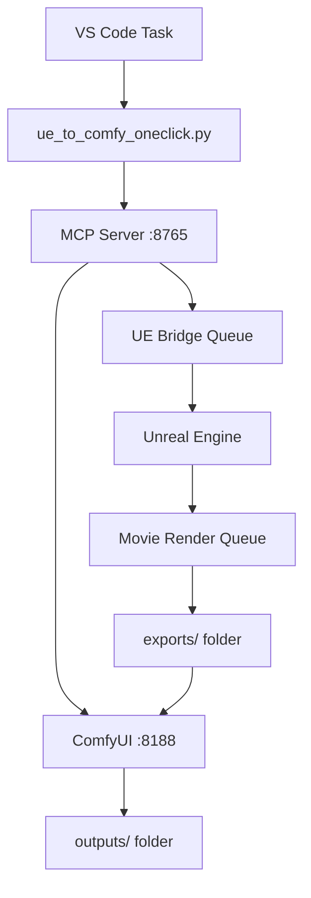

# LevlStudio One-Click UE5 → ComfyUI Bundle

This bundle provides a seamless **one-click pipeline** from Unreal Engine 5 rendering to AI-powered style transfer using ComfyUI. With a single VS Code command, you can:

1. 🎭 **Spawn** a Blueprint actor in UE5
2. 🎞️ **Create** a Level Sequence with camera  
3. 🎬 **Render** via Movie Render Queue (MRQ)
4. 📤 **Transfer** the rendered video to ComfyUI
5. 🎨 **Apply** AI style transfer using WAN-F'N
6. 📁 **Output** a stylized video

## 🗂️ Bundle Components

| File | Purpose |
|------|---------|
| `levl_ue_to_comfy_oneclick_server.py` | MCP server with UE bridge + ComfyUI tools |
| `UE_Content_Python/LevlBridgeWatcherOneClick.py` | Enhanced UE Python watcher |
| `ue_to_comfy_oneclick.py` | CLI orchestrator script |
| `.vscode/tasks.json` | VS Code task configurations |

## 🚀 Quick Start

### 1. Start ComfyUI (Already Running ✅)
ComfyUI is running at: http://127.0.0.1:8188

### 2. Start the MCP Server
```bash
# In VS Code: Run Task → "Start MCP Server (UE→Comfy)"
# Or manually:
cd /Volumes/Jul_23_2025/LevlStudio_Project
python3 levl_ue_to_comfy_oneclick_server.py
```

### 3. Setup Unreal Engine
1. **Enable Python Plugin**:
   - Edit → Plugins → Search "Python"
   - Enable "Python Editor Script Plugin"
   - Restart Unreal Engine

2. **Copy Watcher Script**:
   ```bash
   cp UE_Content_Python/LevlBridgeWatcherOneClick.py /path/to/YourUEProject/Content/Python/
   ```

3. **Create Bridge Folders**:
   ```bash
   mkdir -p /path/to/YourUEProject/LevlStudioBridge/inbox
   mkdir -p /path/to/YourUEProject/LevlStudioBridge/outbox
   ```

### 4. Run One-Click Pipeline

#### Option A: VS Code Task (Recommended)
1. **Press** `Cmd+Shift+P` → "Tasks: Run Task"
2. **Select** "UE → Comfy: One-Click Build+Render+Style"
3. **Enter** parameters:
   - UE Level path: `/Game/Levl/Maps/Empty`
   - Blueprint path: `/Game/The13thNight/Blueprints/BP_Nimble`
   - Style image: Select from dropdown
   - Shot name: `Shot01`
   - Spawn location: `0,0,100`
   - Resolution: `1280x720`
   - FPS: `24`

#### Option B: Command Line
```bash
python3 ue_to_comfy_oneclick.py \
  --level "/Game/Levl/Maps/Empty" \
  --bp_path "/Game/The13thNight/Blueprints/BP_Nimble" \
  --movie_out "./exports/test_shot.mp4" \
  --style_img "./refs/style_festive_night.png" \
  --location "0,0,100" \
  --resolution "1280x720" \
  --fps 24
```

### 5. Process in Unreal Engine
1. **In Unreal**: Menu → **LevlStudio** → **🎬 Run Bridge Once**
2. **Watch** the progress in UE's Output Log
3. **Wait** for render completion (~30s - 5min depending on settings)

### 6. Results
- 🎬 **UE Render**: `exports/` folder
- 🎨 **Styled Video**: `outputs/` folder (processed by ComfyUI)

## 🎛️ Configuration

### Camera Settings
Modify in `UE_Content_Python/LevlBridgeWatcherOneClick.py`:
```python
camera_loc = unreal.Vector(loc.x, loc.y - 500, loc.z + 200)
camera_rot = unreal.Rotator(-10, 0, 0)  # Slight downward angle
```

### Sequence Duration
```python
duration_frames = fps * 4  # 4 seconds
```

### ComfyUI Workflow
Edit `comfy_workflows/wanfn_depth_pose_canny_template.json`:
- Adjust `style_strength` (0-1) for style intensity
- Modify `temporal_consistency` (0-1) for frame coherence
- Change color correction values

### Style Images
Add custom style images to `refs/` folder:
- **Format**: PNG/JPG, 1024x1024 or 512x512 recommended
- **Examples**: 
  - `style_festive_night.png` - Christmas night atmosphere
  - `style_ice_crystal.png` - Frozen/crystalline look
  - `style_magical_glow.png` - Ethereal magical lighting

## 🛠️ Available Tools

### MCP Server Tools
- `ue_build_and_render` - Queue UE render job
- `ue_fetch_result` - Check UE job status  
- `comfy_submit_video` - Submit video to ComfyUI
- `ue_to_comfy_oneclick` - **End-to-end pipeline**
- `check_status` - System status check

### VS Code Tasks
- **UE → Comfy: One-Click Build+Render+Style** - Main pipeline
- **Start MCP Server (UE→Comfy)** - Launch bridge server
- **Install MCP Dependencies** - Setup Python packages
- **Test UE Bridge Connection** - Verify communication
- **Clear Bridge Queue** - Clean up queue files

## 🔧 Troubleshooting

### MCP Server Issues
```bash
# Check if server is running
curl http://127.0.0.1:8765/tools/call -X POST -H "Content-Type: application/json" -d '{"name":"check_status","arguments":{}}'

# Restart server
python3 levl_ue_to_comfy_oneclick_server.py --host 127.0.0.1 --port 8765
```

### UE Bridge Issues
1. **Check bridge folders exist** in UE project
2. **Verify Python plugin enabled**
3. **Check UE Output Log** for errors
4. **Manual test**: Menu → LevlStudio → Run Bridge Once

### ComfyUI Connection
```bash
# Test ComfyUI API
curl http://127.0.0.1:8188/system_stats

# Check ComfyUI logs
# Look for workflow errors in ComfyUI terminal
```

### File Path Issues
- Use **forward slashes** in UE paths: `/Game/...`
- Use **absolute paths** for file system
- Ensure `exports/` and `outputs/` folders exist

## 📊 Performance Tips

- **Resolution**: Start with 1280x720 for testing
- **FPS**: 24fps standard, 30fps for smoother motion  
- **Duration**: Default 4 seconds, adjust in watcher script
- **Quality**: PNG sequence more reliable than direct MP4

## 🎯 Example Workflows

### Character Showcase
```bash
--bp_path "/Game/Characters/BP_Nimble" \
--location "0,0,100" \
--style_img "./refs/style_magical_glow.png" \
--sequence "CharacterShowcase"
```

### Environment Flythrough  
```bash
--level "/Game/Environments/SantaVillage" \
--bp_path "/Game/Props/BP_Sleigh" \
--location "1000,0,500" \
--style_img "./refs/style_festive_night.png"
```

### Action Sequence
```bash
--bp_path "/Game/Characters/BP_EvilElf" \
--location "0,500,0" \
--rotation "0,180,0" \
--style_img "./refs/style_dark_forest.png" \
--fps 30
```

## 🔗 Integration Points

- **Blender**: Export FBX → Import to UE as Blueprint
- **Tripo3D**: Generate → Export GLB → Convert to UE Blueprint  
- **Character Pipeline**: Blender rig → UE Control Rig → Render → Style

## 📝 Technical Notes

- Bridge uses file-based queuing for reliability
- MRQ renders PNG sequence by default (more reliable than direct MP4)
- ComfyUI workflow uses depth, pose, and edge detection for better style transfer
- Results are non-destructive - originals preserved in `exports/`
- Auto-polling available in UE watcher for hands-off operation

## 🎬 System Architecture



---

**LevlStudio One-Click Bundle v2.0** - Seamless UE5 to AI Pipeline